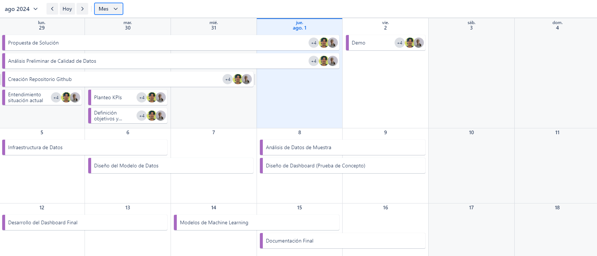

  

*** 
# 
Proyecto de Análisis y Consultoría para NYC TAXIS & CARBON EMISSION

## Sobre el proyecto

**Contexto**

Una empresa en Nueva York dedicada al transporte público
de pasajeros(bus)búsca asesoramiento si le puede resultar 
rentable incluirse  al mercado en una flota de taxis pero generalmente asociados
a taxis eléctricos para ya tener un plus con su implementación ya que se daría cuidado al 
medio ambiente,cuidando asi la contaminación.

**Problematica actual**
- si son rentable o no  la flota de taxis(ing,periodo,viajes)
- si  pueden ser rentable vehículos  a gasolina o eléctricos

**Objetivo**

Evaluar la viabilidad y rentabilidad de expandir la operacion de una empresa de transporte público de pasajeros en Nueva York al mercado de taxis eléctricos, analizando factores economicos y ambientales como ingresos, viajes, emisiones de CO2 y niveles de ruido, para tomar decisiones informadas sobre la implementacion de una flota de taxis sostenibles.

**Alcance**

  

- Alcance temporal: 2017 - 2021

## KPI

__1. Reducción de Emisiones de CO2:__
- Objetivo: Disminuir las emisiones de CO2 generadas por la flota de taxis en un 1% anual.
- Indicador: Emisiones de CO2 (en toneladas) en las áreas donde operaría la flota de taxis eléctricos, comparadas con las emisiones del año anterior en esas mismas zonas.
- Meta: Alcanzar una reducción de CO2 en 1% cada año, tomando como referencia el año anterior.
- Frecuencia de Medición: Anual.

__2. Reducción de la Contaminación Sonora:__
- Objetivo: Reducir los niveles de ruido generados en un 3% semestral.
- Indicador: Medición de los niveles de ruido (en decibelios) en las áreas donde opera la flota de taxis, comparando los niveles antes y después de la implementación de taxis eléctricos.
- Meta: Alcanzar una reducción del ruido de un 3% cada seis meses, con base en el semestre anterior.
- Frecuencia de Medición: Semestral.

__3. Aumento en el Uso de Taxis Eléctricos:__
- Objetivo: Incrementar el porcentaje de viajes realizados por taxis eléctricos en un 5% trimestral.
- Indicador: Porcentaje de viajes realizados por taxis eléctricos sobre el total de viajes realizados por la flota de taxis.
- Meta: Lograr un aumento del 5% en el uso de taxis eléctricos cada trimestre, comparado con el trimestre anterior.
- Frecuencia de Medición: Trimestral.

## Tecnologías 

### Extracción de Datos

-   
  Biblioteca para la manipulación y análisis de datos en Python.
-   
  Extensión de pandas para trabajar con datos geoespaciales.
-   
  Plataforma para la obtencion de datos metereologicos abiertos y gratuitos

### Exploratory Data Analysis (EDA)

-   
  Lenguaje de programación versátil utilizado para análisis de datos y aprendizaje automático.
  Biblioteca para computación numérica en Python.
-   
  Biblioteca para visualización de datos basada en Matplotlib.
-   
  Biblioteca para la creación de gráficos estáticos, animados e interactivos en Python.
-   
  Herramienta para la visualización de datos faltantes en conjuntos de datos.

### Orquestacion de flujo de datos y nube

-   
  Plataforma de nube de Microsoft conocida por su interfaz didáctica y amigable para el usuario.

### Machine Learning

-   
  Utilizado para construir y entrenar modelos de aprendizaje automático.
-   
  Biblioteca de aprendizaje automático en Python.

### Visualización

-   
  Herramienta de análisis y visualización de datos que permite crear informes interactivos y paneles de control.

## PipeLine

## Cronología

## Miembros del Equipo

| **Nombre**   | **Rol en el Proyecto**    |
|--------------|----------------------------|
|  | Data Analyst |
|  | Data Analyst |
|  | Data Engineer |
|  | Data Engineer |
|  | Machine Learning Engineer |